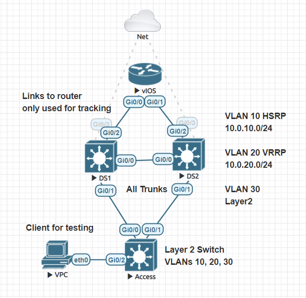

# Automating HSRP/VRRP with Ansible



## Purpose

I was recently going through the IP services chapter of the CCNP ENCOR book and I wanted to take a shot at automating HSRP/VRRP configurations. These two protocols can be used to add redundancy to first hop addresses. From a protocol standpoint and configuration wise they are very similar. Something to call out is that VRRP has preemption enabled by default and some terms are different. Active/Standby for HSRP and Master/Backup for VRRP.

## Prerequisites

1. Ansible ≤ 2.9
2. Access to Cisco CML, GNS3, EVE-NG or some other technology for labbing
3. Validate Ansible control machine has access to nodes

I have a few basic configurations done in this lab. For example, my Ansible control machine has access to the two nodes acting as distribution switches. I have enabled a tracking command for our lab (DS1 --> IOSv RTR). This track is just checking the Up/Down status of the interface connected to our upstream router. `track 1 interface GigabitEthernet0/2 line-protocol`. Trunk interfaces between DS1, DS2, and Access switch are configured as well.

## Project Structure

```
juliopdx@librenms:~/repos$ tree ansible_fhrp/
ansible_fhrp/
├── ansible.cfg
├── fhrp.yaml
├── hosts
├── host_vars
│   ├── DS1.yaml
│   └── DS2.yaml
├── images
│   └── topo.PNG
├── README.md
└── templates
    ├── DS1.conf
    ├── DS2.conf
    └── fhrp.j2
```

As you can see I didnt go all in with roles on this one. Good example of using a barebones structure to automate a simple configuration. For larger projects or for scale I would highly recommend using roles!

### `hosts`

```
locahost

[network]
DS1 ansible_host=192.168.10.101
DS2 ansible_host=192.168.10.102

[network:vars]
ansible_user=cisco
ansible_ssh_pass=cisco
ansible_network_os=ios
```

### `ansible.cfg`

```
[defaults]
host_key_checking=False
inventory=./hosts
deprecation_warnings=false
pipelining = True
stdout_callback = yaml
[ssh_connection]
pipelining = True
```

### `fhrp.yaml`

```yaml
---
- name: Deploying FHRP
  connection: network_cli
  gather_facts: False
  hosts: network
  tasks:
    - name: Save generated configuration
      template:
        src: templates/fhrp.j2
        dest: templates/{{ inventory_hostname}}.conf

    - name: Configure HSRP/VRRP
      ios_config:
        src: templates/fhrp.j2

...
```

The actual playbook file is pretty small. It connects to device, saves config to local host machine directory, and then pushes config to device using the `ios_config` module. Please note, you do not have to use the `template` module for this playbook. This is mainly there to review the configuration file that is created.

## Design Considerations

For this practice run I'm using a few caveats. DS1 will be our main layer 3 switch for the SVIs. Whether its VRRP or HSRP. DS1 will be the active device responding as the gateway. The tracking interface mentioned at the start of this file is only configured on DS1. If the DS1 connection to our router device has issues, its priority will decrement and DS2 will become active. Preemption will be enabled on all SVIs. When DS1 recovers it will take over as active again.  

### `host_vars/DS1.yaml`

```yaml
vlans:

  - name: Wheres
    id: 10
    l3: True
    ip_address: 10.0.10.2/24
    hsrp: True
    standby_ip: 10.0.10.1
    priority: 101
    track:
      number: 1 
      decrement: 50

  - name: Wally
    id: 20
    l3: True
    ip_address: 10.0.20.2/24
    vrrp: True
    standby_ip: 10.0.20.1
    priority: 101
    track:
      number: 1 
      decrement: 50

  - name: IDK
    id: 30
```

Here we have a few VLANs defined. I tried to keep the variables short and sweet. Notice that VLAN 30 has pretty much nothing defined. This will make sense in the jinja template and configuration file that is created. Long story short it will just be a simple layer 2 VLAN added to the device. Check out DS2 variables below and notice there is no tracking defined and priority is set to 99 on all vlans (lower than DS1 at 101). Oh one more bonus, in VRRP, preemption is enabled by default so we can omit that from the jinja template logic.

### `host_vars/DS2.yaml`

```yaml
vlans:

  - name: Wheres
    id: 10
    l3: True
    ip_address: 10.0.10.3/24
    hsrp: True
    standby_ip: 10.0.10.1
    priority: 99

  - name: Wally
    id: 20
    l3: True
    ip_address: 10.0.20.3/24
    vrrp: True
    standby_ip: 10.0.20.1
    priority: 99

  - name: IDK
    id: 30
```

### `templates/fhrp.j2`

```jinja

vlan {{ vlan.id }}
  name {{ vlan.name }}

interface vlan{{ vlan.id }}
  ip address {{ vlan.ip_address | ipaddr('address') }} {{ vlan.ip_address | ipaddr('netmask') }}
  no shutdown

  standby {{ vlan.id }} ip {{ vlan.standby_ip }}
  standby {{ vlan.id }} priority {{ vlan.priority }}
  standby 10 preempt

  standby {{ vlan.id }} track {{ vlan.track.number }} decrement {{ vlan.track.decrement }}




  vrrp {{ vlan.id }} ip {{ vlan.standby_ip }}
  vrrp {{ vlan.id }} priority {{ vlan.priority }}

  vrrp {{ vlan.id }} track {{ vlan.track.number }} decrement {{ vlan.track.decrement }}





```

If you are new to jinja I can see how this may look a bit crazy. We are using a loop at the start to go over our list of VLANs defined in our `host_vars` file for each host. After that we are using a bunch of `if` logic to either do something with the data or just skip over it. For example if I have layer 3 information defined, make an SVI. If I dont then just leave it as is and just make a standard VLAN with no SVI. I will include the output of the file that is generated in the templates folder.

### Pre Checks

```
DS1#show vlan brief 

VLAN Name                             Status    Ports
---- -------------------------------- --------- -------------------------------
1    default                          active    Gi0/2, Gi1/0, Gi1/1, Gi1/2
                                                Gi1/3
1002 fddi-default                     act/unsup 
1003 token-ring-default               act/unsup 
1004 fddinet-default                  act/unsup 
1005 trnet-default                    act/unsup 
DS1#
```

```
DS2#show vlan brief 

VLAN Name                             Status    Ports
---- -------------------------------- --------- -------------------------------
1    default                          active    Gi0/2, Gi1/0, Gi1/1, Gi1/2
                                                Gi1/3
1002 fddi-default                     act/unsup 
1003 token-ring-default               act/unsup 
1004 fddinet-default                  act/unsup 
1005 trnet-default                    act/unsup 
DS2#
```

```
DS1#show ip interface brief | exclude unass
Interface              IP-Address      OK? Method Status                Protocol   
GigabitEthernet0/3     192.168.10.101  YES DHCP   up                    up 

DS1#
```

```
DS2#show ip interface brief | exclude unass
Interface              IP-Address      OK? Method Status                Protocol    
GigabitEthernet0/3     192.168.10.102  YES DHCP   up                    up   

DS2#
```

### Okay lets run the playbook :) 

```
juliopdx@librenms:~/repos/ansible_fhrp$ ansible-playbook fhrp.yaml 

PLAY [Deploying FHRP] **************************************************************************************************************************************************

TASK [Save generated configuration] ************************************************************************************************************************************
changed: [DS2]
changed: [DS1]

TASK [Configure HSRP/VRRP] *********************************************************************************************************************************************
changed: [DS2]
changed: [DS1]

PLAY RECAP *************************************************************************************************************************************************************
DS1                        : ok=2    changed=2    unreachable=0    failed=0    skipped=0    rescued=0    ignored=0   
DS2                        : ok=2    changed=2    unreachable=0    failed=0    skipped=0    rescued=0    ignored=0   

juliopdx@librenms:~/repos/ansible_fhrp$ 
```

Exciting isnt it? Lets check the switches. 

### Post Check

```
DS1#show vlan brief 

VLAN Name                             Status    Ports
---- -------------------------------- --------- -------------------------------
1    default                          active    Gi0/2, Gi1/0, Gi1/1, Gi1/2
                                                Gi1/3
10   Wheres                           active    
20   Wally                            active    
30   IDK                              active    
1002 fddi-default                     act/unsup 
1003 token-ring-default               act/unsup 
1004 fddinet-default                  act/unsup 
1005 trnet-default                    act/unsup 
DS1#
```

```
DS2#show vlan brief 

VLAN Name                             Status    Ports
---- -------------------------------- --------- -------------------------------
1    default                          active    Gi0/2, Gi1/0, Gi1/1, Gi1/2
                                                Gi1/3
10   Wheres                           active    
20   Wally                            active    
30   IDK                              active    
1002 fddi-default                     act/unsup 
1003 token-ring-default               act/unsup 
1004 fddinet-default                  act/unsup 
1005 trnet-default                    act/unsup 
DS2#
```

Looks like all three VLANs are present!

```
DS1#show ip interface brief | exclude unass
Interface              IP-Address      OK? Method Status                Protocol
GigabitEthernet0/3     192.168.10.101  YES DHCP   up                    up      
Vlan10                 10.0.10.2       YES manual up                    up      
Vlan20                 10.0.20.2       YES manual up                    up      

DS1#
```

```
DS2#show ip interface brief | exclude unass
Interface              IP-Address      OK? Method Status                Protocol
GigabitEthernet0/3     192.168.10.102  YES DHCP   up                    up      
Vlan10                 10.0.10.3       YES manual up                    up      
Vlan20                 10.0.20.3       YES manual up                    up      

DS2#
```

Looks like all the SVIs are there and notice, no SVI for VLAN 30. Lets now check HSRP and VRRP on both switches. I forgot to mention, we are using HSRP for VLAN 10 and VRRP for VLAN 20. Lets check HSRP on both switches first.

```
DS1#show standby  
Vlan10 - Group 10
  State is Active
    2 state changes, last state change 00:06:05
  Virtual IP address is 10.0.10.1
  Active virtual MAC address is 0000.0c07.ac0a (MAC In Use)
    Local virtual MAC address is 0000.0c07.ac0a (v1 default)
  Hello time 3 sec, hold time 10 sec
    Next hello sent in 1.104 secs
  Preemption enabled
  Active router is local
  Standby router is 10.0.10.3, priority 99 (expires in 9.200 sec)
  Priority 101 (configured 101)
    Track object 1 state Up decrement 50
  Group name is "hsrp-Vl10-10" (default)
DS1#
```

```
DS2#show standby 
Vlan10 - Group 10
  State is Standby
    3 state changes, last state change 00:06:11
  Virtual IP address is 10.0.10.1
  Active virtual MAC address is 0000.0c07.ac0a (MAC Not In Use)
    Local virtual MAC address is 0000.0c07.ac0a (v1 default)
  Hello time 3 sec, hold time 10 sec
    Next hello sent in 2.256 secs
  Preemption enabled
  Active router is 10.0.10.2, priority 101 (expires in 8.112 sec)
  Standby router is local
  Priority 99 (configured 99)
  Group name is "hsrp-Vl10-10" (default)
DS2#
```

DS1 is active for VLAN 10 and tracking is enabled. Priority for DS1 is 101 and 99 for DS2. Lets move to VRRP on both switches.

```
DS1#show vrrp 
Vlan20 - Group 20 
  State is Master  
  Virtual IP address is 10.0.20.1
  Virtual MAC address is 0000.5e00.0114
  Advertisement interval is 1.000 sec
  Preemption enabled
  Priority is 101 
    Track object 1 state Up decrement 50
  Master Router is 10.0.20.2 (local), priority is 101 
  Master Advertisement interval is 1.000 sec
  Master Down interval is 3.605 sec

DS1#
```

```
DS2#show vrrp
Vlan20 - Group 20 
  State is Backup  
  Virtual IP address is 10.0.20.1
  Virtual MAC address is 0000.5e00.0114
  Advertisement interval is 1.000 sec
  Preemption enabled
  Priority is 99  
  Master Router is 10.0.20.2, priority is 101 
  Master Advertisement interval is 1.000 sec
  Master Down interval is 3.613 sec (expires in 3.245 sec)

DS2#
```

Same idea as before with tracking and priorities. Lets take down interface `Gi0/2` on DS1 and we should see DS2 take over in both cases. 

```
DS1#conf t
Enter configuration commands, one per line.  End with CNTL/Z.
DS1(config)#int g0/2
DS1(config-if)#shut
DS1(config-if)#
*Sep 13 06:26:28.576: %TRACK-6-STATE: 1 interface Gi0/2 line-protocol Up -> Down
DS1(config-if)#
*Sep 13 06:26:28.721: %HSRP-5-STATECHANGE: Vlan10 Grp 10 state Active -> Speak
DS1(config-if)#
*Sep 13 06:26:30.550: %LINK-5-CHANGED: Interface GigabitEthernet0/2, changed state to administratively down
DS1(config-if)#
*Sep 13 06:26:31.319: %VRRP-6-STATECHANGE: Vl20 Grp 20 state Master -> Backup
DS1(config-if)#
*Sep 13 06:26:31.552: %LINEPROTO-5-UPDOWN: Line protocol on Interface GigabitEthernet0/2, changed state to down
DS1(config-if)#
*Sep 13 06:26:40.875: %HSRP-5-STATECHANGE: Vlan10 Grp 10 state Speak -> Standby
DS1(config-if)#
```

DS2 should now take over for both SVIs.

```
DS2#
*Sep 13 06:26:30.086: %HSRP-5-STATECHANGE: Vlan10 Grp 10 state Standby -> Active
DS2#
*Sep 13 06:26:32.606: %VRRP-6-STATECHANGE: Vl20 Grp 20 state Backup -> Master
DS2#show standby 
Vlan10 - Group 10
  State is Active
    4 state changes, last state change 00:02:48
  Virtual IP address is 10.0.10.1
  Active virtual MAC address is 0000.0c07.ac0a (MAC In Use)
    Local virtual MAC address is 0000.0c07.ac0a (v1 default)
  Hello time 3 sec, hold time 10 sec
    Next hello sent in 0.816 secs
  Preemption enabled
  Active router is local
  Standby router is 10.0.10.2, priority 51 (expires in 9.536 sec)
  Priority 99 (configured 99)
  Group name is "hsrp-Vl10-10" (default)
DS2#show vrrp 
Vlan20 - Group 20 
  State is Master  
  Virtual IP address is 10.0.20.1
  Virtual MAC address is 0000.5e00.0114
  Advertisement interval is 1.000 sec
  Preemption enabled
  Priority is 99  
  Master Router is 10.0.20.3 (local), priority is 99  
  Master Advertisement interval is 1.000 sec
  Master Down interval is 3.613 sec

DS2#
```

Ill save you all from looking at too much more CLI output but the following is "recovering" from our outage scenario.

```
DS1(config-if)#no shut
DS1(config-if)#
*Sep 13 06:30:33.043: %TRACK-6-STATE: 1 interface Gi0/2 line-protocol Down -> Up
DS1(config-if)#
*Sep 13 06:30:33.302: %HSRP-5-STATECHANGE: Vlan10 Grp 10 state Standby -> Active
DS1(config-if)#
*Sep 13 06:30:34.148: %LINK-3-UPDOWN: Interface GigabitEthernet0/2, changed state to up
*Sep 13 06:30:35.185: %LINEPROTO-5-UPDOWN: Line protocol on Interface GigabitEthernet0/2, changed state to up
DS1(config-if)#
*Sep 13 06:30:36.518: %VRRP-6-STATECHANGE: Vl20 Grp 20 state Backup -> Master
DS1(config-if)#
```

Thank you all for reading this far. In the end you could avoid all of this and go with a routed access layer ¯\(°_o)/¯. Happy labbing/automating. Stay safe out there, 2020 is a tough one!